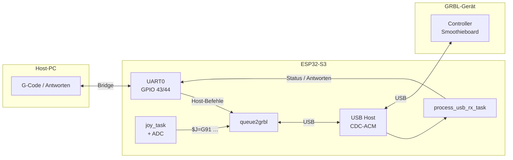

# ESP32 GRBL Joystick Controller (Man-in-the-Middle)

**Sprachen:** [English](README.md) · [Deutsch](README.de.md)

Ein ESP32-S3-Projekt zur Steuerung eines GRBL-gesteuerten CNC-Systems über einen analogen Joystick. Der ESP32 sitzt zwischen Host-PC und GRBL-Controller: **UART0** leitet G-Code und Antworten durch, **USB Host (CDC-ACM)** spricht das GRBL-Gerät an, und der Joystick erzeugt zusätzliche Jog-Befehle.

## Systemübersicht

### Hardware-Schaltplan

```
                    ┌─────────────────────────────────────────────┐
                    │              ESP32-S3 (grbl-joy)            │
                    │                                             │
  Host-PC           │   UART0                         USB Host    │           GRBL-Controller
  (CAM / Sender)    │   GPIO 43 TX  ───────────────►  CDC-ACM     │◄────────► (Smoothieboard)
       │            │   GPIO 44 RX  ◄───────────────              │    USB
       │            │                                             │
       └────────────┼─────────────────────────────────────────────┘
         115200     │
                    │   Joystick X ──► GPIO 13 (ADC2, Kanal 2)
                    │   Joystick Y ──► GPIO 14 (ADC2, Kanal 3)
                    │
                    │   WS2812 LED ──► GPIO 48
                    │
                    │   Log / Monitor ──► UART1 GPIO 17/18 (115200)
                    └─────────────────────────────────────────────┘
```

### Datenfluss (Firmware)



| Richtung | Pfad | Inhalt |
|----------|------|--------|
| Host → GRBL | UART0 → TX-Queue → USB | G-Code, `$`-Befehle |
| GRBL → Host | USB → RX-Task → UART0 | `ok`, Status, Alarme |
| Joystick → GRBL | ADC → `joy_task` → TX-Queue → USB | `$J=G91 X.. Y.. F..` |
| Debug | UART1 | ESP-IDF-Logausgabe |

## Features

- UART↔USB-Bridge zwischen Host (UART0) und GRBL-Gerät (USB CDC-ACM)
- Joystick-basierte Jogging-Steuerung (`$J=G91 …`) mit proportionaler Geschwindigkeit und Schrittweite
- Automatische Joystick-Kalibrierung beim Start (Nullpunkt und Rauschschwelle pro Achse)
- ADC-basierte Start/Stopp-Hysterese und adaptive Nullpunkt-Nachführung in Ruhe
- Automatische GRBL-Konfigurationsabfrage (`$$`) nach USB-Verbindung
- Fehlererkennung (`ALARM`, `ERROR`) und automatischer Stop
- Automatischer Reconnect bei USB-TX-Fehler, CDC-Fehler oder Disconnect
- WS2812B-Status-LED:
  - **Blau:** Gerät verbunden
  - **Rot:** Gerät getrennt

## Hardware Requirements

- ESP32-S3 Dev Board (z. B. ESP32-S3-DevKit)
- GRBL-Gerät mit USB CDC-ACM (z. B. Smoothieboard/LPC17xx)
- Analoger Joystick (X/Y-Achsen)
- Optional: WS2812B-LED (1 Pixel reicht)

## Pin Configuration

| Signal | ESP32-S3 Pin | Anmerkung |
|--------|--------------|-----------|
| UART0 TX (Host) | GPIO 43 | Bridge zum CAM/Host |
| UART0 RX (Host) | GPIO 44 | Bridge zum CAM/Host |
| UART1 TX (Log) | GPIO 17 | ESP-IDF-Konsole / Monitor |
| UART1 RX (Log) | GPIO 18 | ESP-IDF-Konsole / Monitor |
| Joystick X | GPIO 13 | ADC2, Kanal 2 |
| Joystick Y | GPIO 14 | ADC2, Kanal 3 |
| WS2812 LED | GPIO 48 | Statusanzeige |

Hinweis: Joystick-ADC mit 12 Bit Auflösung und 12 dB Dämpfung (`ADC_ATTEN_DB_12`).

### Optional: UART0 Hardware-Flow-Control (RTS/CTS)

Wenn der Host G-Code schneller sendet, als GRBL verarbeiten kann, Flow-Control aktivieren — der ESP32 pausiert den Host, bevor UART-Puffer überlaufen.

| Einstellung | Standard | Beschreibung |
|-------------|----------|--------------|
| `UART0_FLOW_CONTROL` | `0` | auf `1` setzen zum Aktivieren |
| `UART0_RTS_PIN` | GPIO 21 | ESP32 RTS-Ausgang → **Host CTS**-Eingang |
| `UART0_CTS_PIN` | NC | optional: Host RTS → ESP32 CTS |
| `UART0_RX_FLOW_CTRL_THRESH` | 64 | HW-FIFO-Füllstand, ab dem RTS gesetzt wird |

Verkabelung (Minimum):

```
ESP32-S3          Host (USB-UART-Adapter / PC)
GPIO 43 TX   ──►  RX
GPIO 44 RX   ◄──  TX
GPIO 21 RTS  ──►  CTS        (nur bei UART0_FLOW_CONTROL = 1)
GND          ──►  GND
```

Der Host muss CTS respektieren (die meisten USB-Seriell-Adapter unterstützen das, wenn Flow Control im Treiber aktiv ist). Linux: `stty -F /dev/ttyUSB0 crtscts`.

## USB-Gerät

Standardmäßig wird nach folgendem CDC-ACM-Gerät gesucht (Smoothieboard):

| Parameter | Wert |
|-----------|------|
| VID | `0xFFFF` |
| PID | `0x0005` |

Anpassen in `main/main.cpp`: `USB_TARGET_VID`, `USB_TARGET_PID`.

## Software Requirements

- ESP-IDF ≥ 5.1
- FreeRTOS (Teil von ESP-IDF)
- USB Host Stack (`usb_host_cdc_acm`)
- GRBL-fähiges Gerät über USB

## Installation

ESP-IDF einrichten und Toolchain installieren: [ESP-IDF Getting Started Guide](https://docs.espressif.com/projects/esp-idf/en/latest/esp32s3/get-started/index.html)

```bash
git clone https://github.com/gerrylenz/esp32-s3-joystick.git
cd esp32-s3-joystick
```

Optional konfigurieren:

```bash
idf.py menuconfig
```

Flashen und Monitor starten (Log-Ausgabe über UART1, GPIO 17/18):

```bash
idf.py flash monitor
```

## Usage

1. Joystick in Mittelstellung halten und ESP32 starten.
2. Host-PC an UART0 (GPIO 43/44) und GRBL-Board per USB am ESP32 anschließen.
3. Nach USB-Verbindung fragt der ESP32 automatisch die GRBL-Konfiguration ab (`$$`) und liest u. a. `$110` (max. Feedrate X).
4. Joystick-Bewegungen werden in Jog-Befehle umgewandelt: `$J=G91 X.. Y.. F..`
5. Bei `ALARM` oder `ERROR` während Jogging: Stop, Queue leeren, `$X`-Reset.
6. LED-Status: blau = verbunden, rot = getrennt.

## Jogging-Parameter (Code)

| Parameter | Wert | Konstante in `main.cpp` |
|-----------|------|-------------------------|
| Software-Totzone | ±22 (−100…+100) | `JOYSTICK_DEADZONE_STOP` |
| Start-Hysterese | ADC-Rausch + 55 Counts | `JOYSTICK_ADC_START_EXTRA` |
| Stopp-Hysterese | ADC-Rausch + 6 Counts | `JOYSTICK_ADC_IDLE_MARGIN` |
| Start-Bestätigung | 4 × 10 ms | `JOYSTICK_START_SAMPLES` |
| Min. Jog-Schritt | 0,008 mm | `JOG_MIN_STEP_MM` |
| Lookahead-Faktor | 2,0 Segmente | `JOG_LOOKAHEAD_SEGMENTS` |
| Min. Feedrate | 1 mm/min | `JOYSTICK_MIN_FEEDRATE` |
| Max. Feedrate | aus GRBL `$110`, Fallback 4000 | `JOYSTICK_DEFAULT_MAX_FEED` |
| Jog-/ADC-Intervall | 10 ms | `JOG_INTERVAL` in `joy_task()` |
| Nullpunkt-Kalibrierung | 64 Samples beim Start | `JOYSTICK_CENTER_SAMPLES` |
| Nullpunkt-Nachführung | nach ~400 ms Ruhe | `JOYSTICK_CENTER_TRACK_SAMPLES` |

Jog-Befehle nutzen `$J=G91 X.. Y.. F..`; Schrittweite und Feedrate ergeben sich aus Joystick-Ausschlag und `$110`. Jeder Befehl wird erst nach GRBL-`ok` gesendet (`ok_sem`).

Achsen-Invertierung in `configure_joy()`: `joystick.xHardwareReversed`, `joystick.yHardwareReversed`.

## Code Structure

| Funktion / Modul | Aufgabe |
|------------------|---------|
| `app_main()` | Initialisierung von UART, ADC, LED, Queues und Tasks |
| `usb_connect_loop()` | USB-Verbindung, Line-Coding, GRBL-Config, Reconnect |
| `usb_host_task()` | USB-Host-Event-Loop |
| `uart_event_task()` | UART0 → TX-Queue (Host → GRBL) |
| `process_usb_rx_task()` | USB-RX parsen, Fehler/Jog-Filter, UART0 (GRBL → Host) |
| `queue2grbl()` | TX-Queue und Stop-Bytes an GRBL senden |
| `joy_task()` | Joystick lesen, proportionale Jog-Befehle erzeugen |
| `calibrate_joystick_center()` | Nullpunkt und Rausch beim Start messen |
| `on_usb_connected()` | `$$` senden und GRBL-Settings laden |
| `recover_usb_link()` | Jog stoppen, Queues leeren, Gerät schließen, Reconnect |
| `adc_init()` / `adc_read()` | ADC-Konfiguration und Joystick-Lesen |
| `apply_grbl_max_feed()` | `$110` aus Config-Puffer lesen |
| `led_control.cpp` | WS2812-Status-LED |

## Notes

- Maximalgeschwindigkeit für Jogging wird aus der GRBL-Konfiguration (`$110`) gelesen; bis dahin gilt der Fallback `JOYSTICK_DEFAULT_MAX_FEED`.
- USB CDC-ACM nutzt blockierendes Senden (`cdc_acm_host_data_tx_blocking`), um Datenverlust zu vermeiden.
- Bei USB-TX-Fehler, CDC-Fehler oder Disconnect: Jog-Stopp, Queue leeren, Gerät schließen und automatischer Reconnect (500 ms Pause).
- Logs erscheinen auf UART1 (115200 Baud), nicht auf UART0 — UART0 ist für die Host-Bridge reserviert.
- TX-Queue-Backpressure: Host-Daten warten auf freien Platz in `tx_usb_queue`; Overflow-Zähler werden als Warnung geloggt (`tx_queue_*`, `uart_rx_overflow_count`).
- Bei dauerhaft hohem Host-Durchsatz `UART0_FLOW_CONTROL` aktivieren (siehe oben).

## License

free to use @ your own risk
