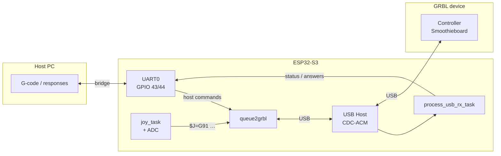

# ESP32 GRBL Joystick Controller (Man-in-the-Middle)

**Languages:** [English](README.md) · [Deutsch](README.de.md)

An ESP32-S3 firmware project for jogging a GRBL-controlled CNC machine with an analog joystick. The ESP32 sits between the host PC and the GRBL controller: **UART0** forwards G-code and responses, **USB Host (CDC-ACM)** talks to the GRBL device, and the joystick injects additional jog commands.

## System Schematic

### Hardware wiring

```
                    ┌─────────────────────────────────────────────┐
                    │              ESP32-S3 (grbl-joy)             │
                    │                                             │
  Host PC           │   UART0                         USB Host    │           GRBL controller
  (CAM / sender)    │   GPIO 43 TX  ───────────────►  CDC-ACM    │◄────────► (Smoothieboard)
       │            │   GPIO 44 RX  ◄───────────────             │    USB
       │            │                                             │
       └────────────┼─────────────────────────────────────────────┘
         115200     │
                    │   Joystick X ──► GPIO 13 (ADC2, ch. 2)
                    │   Joystick Y ──► GPIO 14 (ADC2, ch. 3)
                    │
                    │   WS2812 LED ──► GPIO 48
                    │
                    │   Log / monitor ──► UART1 GPIO 17/18 (115200)
                    └─────────────────────────────────────────────┘
```

### Data flow (firmware)



| Direction | Path | Content |
|-----------|------|---------|
| Host → GRBL | UART0 → TX queue → USB | G-code, `$` commands |
| GRBL → Host | USB → RX task → UART0 | `ok`, status, alarms |
| Joystick → GRBL | ADC → `joy_task` → TX queue → USB | `$J=G91 X.. Y.. F..` |
| Debug | UART1 | ESP-IDF log output |

## Features

- UART↔USB bridge between host (UART0) and GRBL device (USB CDC-ACM)
- Joystick-based jogging (`$J=G91 …`)
- 10-step quantization per axis for smooth motion
- Fixed joystick deadzone (±20 on a −100…+100 scale, ~10%)
- Automatic GRBL configuration query (`$$`) after USB connection
- Error detection (`ALARM`, `ERROR`) with automatic stop
- Automatic reconnect on USB TX errors, CDC errors, or disconnect
- WS2812B status LED:
  - **Blue:** device connected
  - **Red:** device disconnected

## Hardware Requirements

- ESP32-S3 dev board (e.g. ESP32-S3-DevKit)
- GRBL device with USB CDC-ACM (e.g. Smoothieboard / LPC17xx)
- Analog joystick (X/Y axes)
- Optional: WS2812B LED (one pixel is enough)

## Pin Configuration

| Signal | ESP32-S3 Pin | Notes |
|--------|--------------|-------|
| UART0 TX (host) | GPIO 43 | Bridge to CAM/host |
| UART0 RX (host) | GPIO 44 | Bridge to CAM/host |
| UART1 TX (log) | GPIO 17 | ESP-IDF console / monitor |
| UART1 RX (log) | GPIO 18 | ESP-IDF console / monitor |
| Joystick X | GPIO 13 | ADC2, channel 2 |
| Joystick Y | GPIO 14 | ADC2, channel 3 |
| WS2812 LED | GPIO 48 | Status indicator |

Note: Joystick ADC uses 12-bit resolution and 12 dB attenuation (`ADC_ATTEN_DB_12`).

## USB Device

By default the firmware looks for this CDC-ACM device (Smoothieboard):

| Parameter | Value |
|-----------|-------|
| VID | `0xFFFF` |
| PID | `0x0005` |

Adjust in `main/main.cpp`: `USB_TARGET_VID`, `USB_TARGET_PID`.

## Software Requirements

- ESP-IDF ≥ 5.1
- FreeRTOS (included with ESP-IDF)
- USB Host stack (`usb_host_cdc_acm`)
- GRBL-capable device over USB

## Installation

Set up ESP-IDF and the toolchain: [ESP-IDF Getting Started Guide](https://docs.espressif.com/projects/esp-idf/en/latest/esp32s3/get-started/index.html)

```bash
git clone https://github.com/gerrylenz/esp32-s3-joystick.git
cd esp32-s3-joystick
```

Optional configuration:

```bash
idf.py menuconfig
```

Build, flash, and monitor (log output on UART1, GPIO 17/18):

```bash
idf.py flash monitor
```

## Usage

1. Center the joystick and power on the ESP32.
2. Connect the host PC to UART0 (GPIO 43/44) and the GRBL board via USB to the ESP32.
3. After USB connection the ESP32 queries GRBL configuration (`$$`) and reads `$110` (max. X feed rate).
4. Joystick motion is converted to jog commands: `$J=G91 X.. Y.. F..`
5. On `ALARM` or `ERROR` during jogging: stop, clear queue, send `$X` reset.
6. LED status: blue = connected, red = disconnected.

## Jogging Parameters (Code)

| Parameter | Value | Constant in `main.cpp` |
|-----------|-------|------------------------|
| Deadzone | ±20 (−100…+100) | `JOYSTICK_DEADZONE` |
| Quantization | 10 steps per axis | `quantize_10()` |
| Step size | 0.1 mm | `JOYSTICK_STEP_MM` |
| Min. feed rate | 500 mm/min | `JOYSTICK_MIN_FEEDRATE` |
| Max. feed rate | from GRBL `$110`, fallback 4000 | `JOYSTICK_DEFAULT_MAX_FEED` |
| Jog interval | 10 ms | `JOG_INTERVAL` in `joy_task()` |
| ADC sampling | 50 ms | `ADC_INTERVAL` in `joy_task()` |

Axis inversion in `configure_joy()`: `joystick.xHardwareReversed`, `joystick.yHardwareReversed`.

## Code Structure

| Function / Module | Purpose |
|-------------------|---------|
| `app_main()` | Init UART, ADC, LED, queues, and tasks |
| `usb_connect_loop()` | USB connect, line coding, GRBL config, reconnect |
| `usb_host_task()` | USB host event loop |
| `uart_event_task()` | UART0 → TX queue (host → GRBL) |
| `process_usb_rx_task()` | Parse USB RX, filter jog/errors, forward to UART0 |
| `queue2grbl()` | Send TX queue and stop bytes to GRBL |
| `joy_task()` | Read joystick, generate jog commands |
| `on_usb_connected()` | Send `$$` and load GRBL settings |
| `recover_usb_link()` | Stop jog, clear queues, close device, trigger reconnect |
| `adc_init()` / `adc_read()` | ADC setup and joystick reading |
| `apply_grbl_max_feed()` | Read `$110` from config buffer |
| `led_control.cpp` | WS2812 status LED |

## Notes

- Jog max. speed is taken from GRBL setting `$110`; until loaded, `JOYSTICK_DEFAULT_MAX_FEED` applies.
- USB CDC-ACM uses blocking transmit (`cdc_acm_host_data_tx_blocking`) to reduce data loss.
- On USB TX failure, CDC error, or disconnect: stop jogging, clear queues, close the device, reconnect after 500 ms.
- Logs go to UART1 (115200 baud), not UART0 — UART0 is reserved for the host bridge.

## License

free to use @ your own risk
